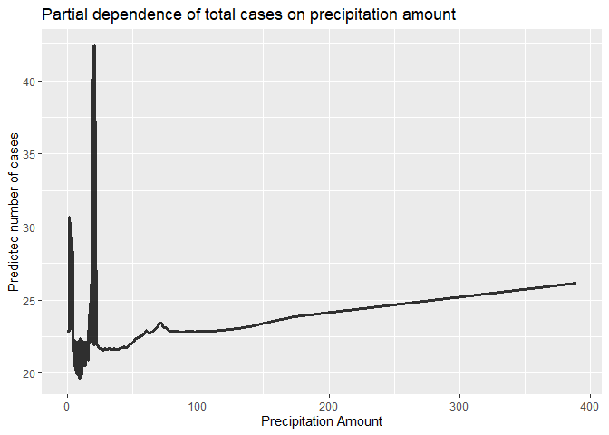
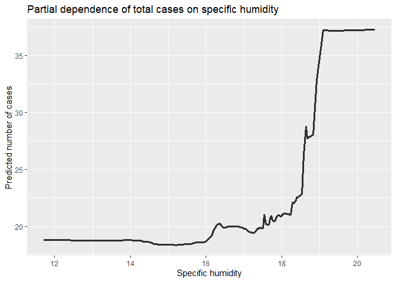
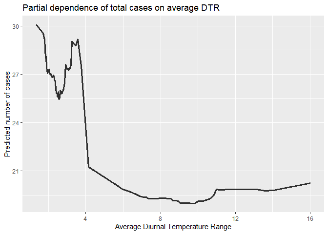

# What causes what?

## Overview

Researchers from UPenn were interested in seeing if there was a causal
relationship between police presence and crime *in that order*. They
used “High Alert” notices in Washington D.C. as an instrumental variable
for police presence, as police presence in this instance is related to a
threat of terrorism rather than crime levels.

1.  The regression estimates will be highly biased because the
    correlation between crime and number of police in a city is
    extremely high. We could not establish causality with this
    regression.
2.  The researchers from UPenn found a scenario in which number of
    police is *not* caused by crime rate. Specifically, in Washington,
    D.C., the city is on “High Alert” if the risk of terrorism at the
    time is high. Thus the number of police stationed in the city is
    high and unrelated to the actual level of crime that occurs. Their
    regression shows that when policy presence is high, the crime level
    decreases.
3.  The researchers controlled for the possibility that people might not
    be outside in the D.C. area during High Alert times. In Table 2,
    they find that even after controlling for number of people active in
    the city, the level of crime still decreases at a significant level
    when police presence is high.
4.  The model being estimated here creates an interaction with high
    alert and district 1 (which I assume is the National Mall). Having a
    high presence of police in district 1 results in a much greater
    decrease in crime compared to having a high presence of police and
    crime in other districts. Once controlling for those interactions,
    the increase in crime from a high presence of foot traffic (measured
    by midday ridership) is less significant. So a decrease in crime is
    significantly dependent on location, not just the number of people
    around.

# Tree modeling: dengue cases

## Overview

The goal here is to compare three tree-based models for predicting
dengue fever in Latin America. Specifically, we want to predict total
cases in two Latin American cities: San Juan, Puerto Rico and Iquitos,
Peru. We will be comparing the predictive value of a CART, Random
Forests, and Boosted Tree model.

Our dataset contains variables related to the persistence of mosquito
breeding and spreading in the area, which will be used as predictors.
First, I created a train-test split of the data, and created folds for
cross-validation from the training data. The testing data will be
reserved for a final comparison of out-of-sample performance.

### Comparisons

The CART model was fit using a regression of total cases in the week on
city, season and meteorological variables using the training data. I
used the `tidymodels` package and `rpart` engine to specify the decision
tree. After fitting the model, I identified the optimal cost complexity
and tree depth parameters that would minimize the RMSE through
cross-validation. The model was then pruned so that the final decision
tree used the optimal parameters `cp = 1e=-04` and `tree_depth =5`.
Finally, the in-sample performance was calculated after cross-validation
using the training data, and out-of-sample performance was calculated
using the testing data.

The same regression that was used in the CART model also is used to fit
the random forest and boosted tree models. I calculated the in-sample
and out-of-sample performances for this model. Fitting the boosted tree
model was similar, and the in-sample and out-of-sample performances for
the three models are summarized below.

<table>
<thead>
<tr class="header">
<th>Model</th>
<th>Out-Of-Sample RMSE</th>
<th>In-Sample RMSE</th>
</tr>
</thead>
<tbody>
<tr class="odd">
<td>CART</td>
<td>25.3</td>
<td>24.4</td>
</tr>
<tr class="even">
<td>RF</td>
<td>24.3</td>
<td>26.21</td>
</tr>
<tr class="odd">
<td>Boosted</td>
<td>27.8</td>
<td>28.2</td>
</tr>
</tbody>
</table>

### Partial Dependence Plots

The random forests model has the lowest out of sample RMSE. So we use
this model for the partial dependence plots:

The final plot shows the partial dependence of total cases on average
DTR, or Average Diurnal Temperature Range for the week. The other
partial dependence plots show an obvious upward trend, while DTR shows a
dip as temperature range increases. This is probably because temperature
does not change much when it is humid. There is a slight increase at the
upper end of the x axis, which may be because heavy rain can cool down
temperatures. The results from the partial dependence plot provide more
insight into which specific conditions will result in higher dengue
cases.

# Green Certification

## Overview

In this problem, we are working with a dataset related to commerical
rental properties across the United States. There are 7894 properties in
total, and 685 of these have been awarded a LEED or EnergyStar
certification is being a “green building.” The dataset contains 23
predictor variables, containing information on the buildings themselves
and details about the surrounding area.

The goal is to create the best predictive model for revenue per square
foot per year, and to see how being green certified effects this
outcome.

## Data and Results

First, I created the revenue per square foot variable `revenue_sqft` by
multiplying `Rent` and `leasing_rate`. In order to isolate the effects
of all other predictor variables, I naturally removed these variables
from the dataset. However, upon running a Random Forest regression, the
out-of-sample RMSE was more than twice the RMSE of the in-sample
predictions. I then ran the Random Forest model again, this time
including rent and leasing rate, to see what the issue was:

After fitting the random forests model, I created a variable importance
plot, which confirmed that the rent and leasing rate variables were
overwhelming any predictive power of the other variables. I perform a
lasso regression next to allow R to select important variables itself.

The RMSE was high, but there was no longer evidence of overfitting. I
then ran random forest and lasso regressions again, including rent and
leasing rate in the regression.

<table style="width:99%;">
<colgroup>
<col style="width: 62%" />
<col style="width: 18%" />
<col style="width: 18%" />
</colgroup>
<thead>
<tr class="header">
<th>Model</th>
<th>RMSE in</th>
<th>RMSE out</th>
</tr>
</thead>
<tbody>
<tr class="odd">
<td>Lasso (with rent, leasing rate)</td>
<td>125</td>
<td>128</td>
</tr>
<tr class="even">
<td>Lasso (without rent, leasing rate)</td>
<td>622</td>
<td>625</td>
</tr>
<tr class="odd">
<td>Random Forest (with rent, leasing rate)</td>
<td>72</td>
<td>86</td>
</tr>
<tr class="even">
<td>Random Forest (without rent, leasing rate)</td>
<td>288</td>
<td>710</td>
</tr>
</tbody>
</table>

What we notice in the table is that by excluding rent and leasing rate
from the regression is that the variance of the estimates increases.
This is obvious due to the overfitting of the random forest model even
when R chooses the optimal tree depth and number of randomly selected
predictors. The lasso regression performs similarly in and out of
sample. But with the exclusion of rent and leasing rate, the model has a
harder time predicting what the revenue per square foot of the building
will be, so the variance increases. However, we can better isolate the
effects of predictor variables that are not almost perfectly correlated
with our response variable `revenue_sqft`. I include the lasso
regression estimates both including and excluding rent and leasing rate:

<table>
<colgroup>
<col style="width: 32%" />
<col style="width: 29%" />
<col style="width: 37%" />
</colgroup>
<thead>
<tr class="header">
<th>Lasso estimate of <code>green_rating</code> (with)</th>
<th><strong>Lasso estimate of <code>LEED</code> (with)</strong></th>
<th><strong>Lasso estimate of <code>green_rating</code> (without)</strong></th>
</tr>
</thead>
<tbody>
<tr class="odd">
<td>0</td>
<td>-26</td>
<td>194</td>
</tr>
</tbody>
</table>

So holding all else constant, having a green rating increases revenue
per square foot (per calendar year) by $194.

I include the summary statistics of `revenue_sqft` for reference:

<table>
<thead>
<tr class="header">
<th style="text-align: left;"></th>
<th style="text-align: right;">Value</th>
</tr>
</thead>
<tbody>
<tr class="odd">
<td style="text-align: left;">Min.</td>
<td style="text-align: right;">0</td>
</tr>
<tr class="even">
<td style="text-align: left;">1st Qu.</td>
<td style="text-align: right;">1500</td>
</tr>
<tr class="odd">
<td style="text-align: left;">Median</td>
<td style="text-align: right;">2141</td>
</tr>
<tr class="even">
<td style="text-align: left;">Mean</td>
<td style="text-align: right;">2406</td>
</tr>
<tr class="odd">
<td style="text-align: left;">3rd Qu.</td>
<td style="text-align: right;">3000</td>
</tr>
<tr class="even">
<td style="text-align: left;">Max.</td>
<td style="text-align: right;">24960</td>
</tr>
</tbody>
</table>

# California Housing

Here, we are working with data on residential housing in the state of
California. Each observation comes from a census tract, or a Census
Bureau defined neighborhood. The dataset includes the latitude and
longitude of each census tract, demographic statistics related to income
and population, and information on the houses themselves. I build the
best predictive model for determining house prices in California given
the information from the census data.

## Working with the data

As always, I create a train-test split of the data and folds for
cross-validation. However, two of our variables `totalRooms` and
`totalBedrooms` represent total rooms and bedrooms *within* the census
district, so I standardize these variables by the number of households
in the district to turn them into averages.

For choosing the best predictive model, the two options that seemed most
useful were gradient boosting or stepwise selection. The small number of
predictors meant gradient boosting would run less of a risk of
overfitting. However, stepwise selection seemed right for predicting
house value because of the high possibility of interactions between
variables that I can’t see myself. To find the best predictive model, I
compare the performance of a gradient boosted tree to a stepwise model.

The baseline model for stepwise selection was
`lm(medianHouseValue ~ . - longitude - latitude, data = ca_train).`

I then created an aribitrary boost specification and found optimal
hyperparameters using the `tune()` function and a tuning grid. This
approach uses cross-validation to find the best possible boosted model.
The optimal parameters selected were:

<table>
<thead>
<tr class="header">
<th style="text-align: right;">Tree Depth</th>
<th style="text-align: right;">Learn Rate</th>
<th style="text-align: right;">Sample Size</th>
</tr>
</thead>
<tbody>
<tr class="odd">
<td style="text-align: right;">1</td>
<td style="text-align: right;">0.3162278</td>
<td style="text-align: right;">1</td>
</tr>
</tbody>
</table>

I also calculated the in-sample RMSE by cross validation, and the
out-of-sample performance using the testing data. To summarize the
results:

<table>
<thead>
<tr class="header">
<th>Model</th>
<th>In-Sample Performance</th>
<th>Out-of-sample Performance</th>
</tr>
</thead>
<tbody>
<tr class="odd">
<td>Boosted Tree</td>
<td>70591</td>
<td>71379</td>
</tr>
<tr class="even">
<td>Stepwise selection</td>
<td>72923</td>
<td>77602</td>
</tr>
</tbody>
</table>

Clearly, the boosted tree performs better than the stepwise model.

## Mapping the results

Using the `ggmap` package, we can visualize the results on an actual map
of California.

A map of the predictions on the testing data:

A map of the residuals from the predictions:

Looking at the residuals from the predictions on the test set, the model
appears to have done a good job at predicting (except for some
over-predictions).
