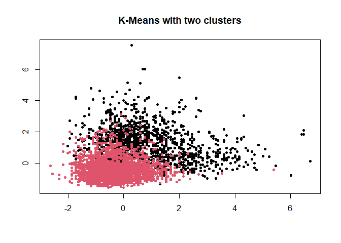
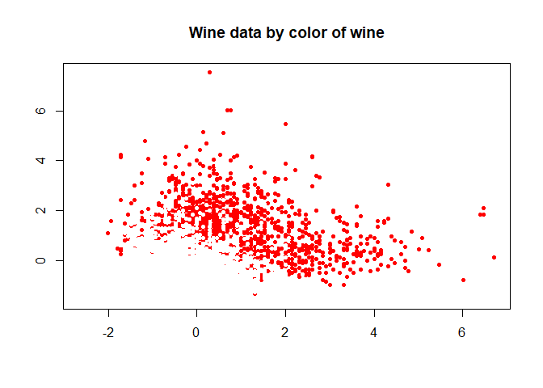
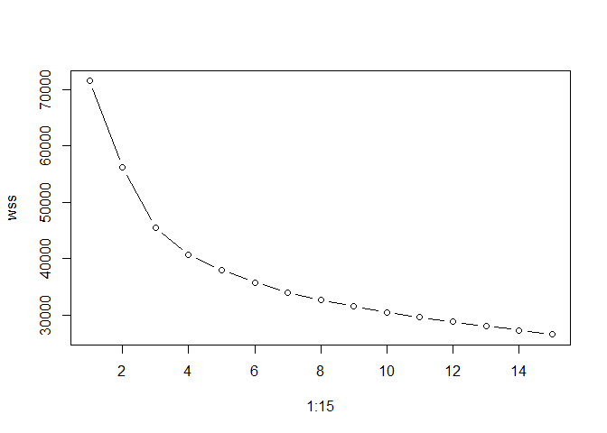
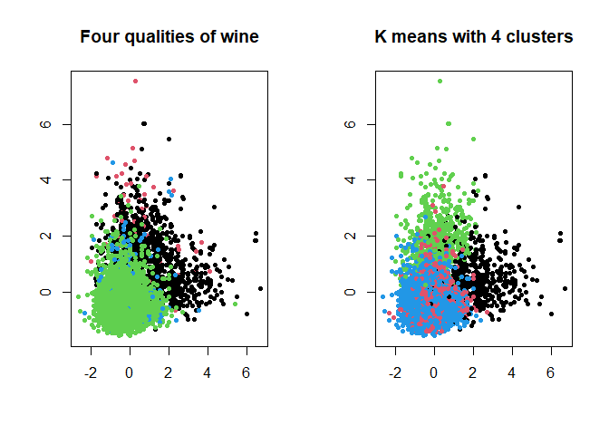
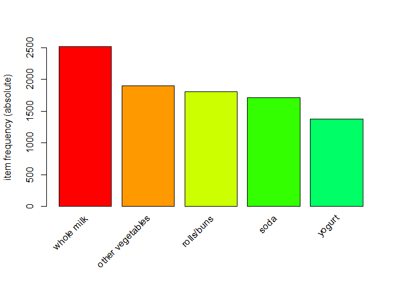
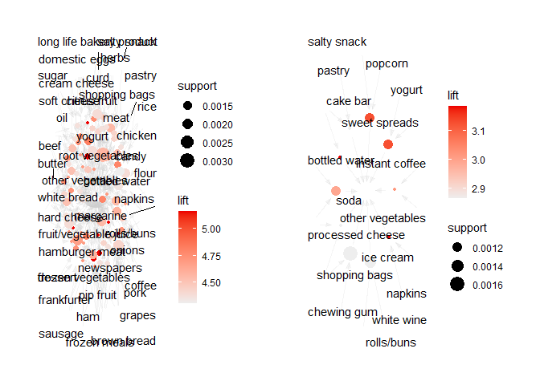

# Problem 1: Clustering and PCA

## Overview

The properties of 6500 different bottles of wine are included in the
`wine` dataset. Along with 11 chemical properties, we have an indicator
for whether the wine is red or white, and the quality of the wine, rated
on a scale from 1-10. The goal here is to use unsupervised learning
methods to categorize the information in the dataset. Additionally, we
want to determine if the analysis can distinguish higher quality wines
from lower quality ones.

## Clustering Analysis

First, I attempt to solve this problem through cluster analysis.
Specifically, I will be using the K-means algorithm. I normalize the
data with the `scale` function from the base R library. This function
centers the numeric columns of the dataset. To see if this algorithm
distinguishes reds from whites, I set the number of clusters to 2.

Here we see that the algorithm almost perfectly distinguishes reds from
whites. It only misses some whites that are similar to reds, so those
white wines must have more sugar or more acidity.

### Choosing the right number of clusters

The crook of the elbow seems to occur at 4, or the marginal value of the
next k seems to peak at k = 4. This is something we can work with;
consider there to be 4 types of wine: high quality red wine, high
quality white wine, low quality red wine, and low quality white wine. I
create a variable `color_quality`, which is an indicator of whether the
wine is red or white and of high quality (≥ 5) or low quality (&lt; 5),
to distinguish these four types. The results are summarized in the two
plots below. See the table for reference as to what the colors mean in
the left plot.

<table>
<thead>
<tr class="header">
<th>Category Name</th>
<th>Indicator</th>
<th>Corresponding Color</th>
</tr>
</thead>
<tbody>
<tr class="odd">
<td>High quality red wine</td>
<td>1</td>
<td>Black</td>
</tr>
<tr class="even">
<td>Low quality red wine</td>
<td>2</td>
<td>Red</td>
</tr>
<tr class="odd">
<td>High quality white wine</td>
<td>3</td>
<td>Green</td>
</tr>
<tr class="even">
<td>Low quality white wine</td>
<td>4</td>
<td>Blue</td>
</tr>
</tbody>
</table>

It appears that K means is good at distinguishing high quality wine
wines and goes half and half with the quality of red wine. It’s possible
that wine snobs consider all red wine to be high quality when a lot of
it has characteristics of a low quality wine. Or, the wines that K-means
considers to be high or low quality (based on chemical properties) is
different than what wine snobs would consider to be high or low quality.

## Principal Components Analysis

<table>
<colgroup>
<col style="width: 17%" />
<col style="width: 7%" />
<col style="width: 7%" />
<col style="width: 7%" />
<col style="width: 7%" />
<col style="width: 7%" />
<col style="width: 7%" />
<col style="width: 7%" />
<col style="width: 7%" />
<col style="width: 7%" />
<col style="width: 7%" />
<col style="width: 7%" />
</colgroup>
<thead>
<tr class="header">
<th style="text-align: left;"></th>
<th style="text-align: right;">PC1</th>
<th style="text-align: right;">PC2</th>
<th style="text-align: right;">PC3</th>
<th style="text-align: right;">PC4</th>
<th style="text-align: right;">PC5</th>
<th style="text-align: right;">PC6</th>
<th style="text-align: right;">PC7</th>
<th style="text-align: right;">PC8</th>
<th style="text-align: right;">PC9</th>
<th style="text-align: right;">PC10</th>
<th style="text-align: right;">PC11</th>
</tr>
</thead>
<tbody>
<tr class="odd">
<td style="text-align: left;">Standard deviation</td>
<td style="text-align: right;">1.7406518</td>
<td style="text-align: right;">1.5791852</td>
<td style="text-align: right;">1.2475364</td>
<td style="text-align: right;">0.9851660</td>
<td style="text-align: right;">0.8484544</td>
<td style="text-align: right;">0.7793021</td>
<td style="text-align: right;">0.7232971</td>
<td style="text-align: right;">0.7081739</td>
<td style="text-align: right;">0.5805377</td>
<td style="text-align: right;">0.4771748</td>
<td style="text-align: right;">0.1811927</td>
</tr>
<tr class="even">
<td style="text-align: left;">Proportion of Variance</td>
<td style="text-align: right;">0.2754426</td>
<td style="text-align: right;">0.2267115</td>
<td style="text-align: right;">0.1414861</td>
<td style="text-align: right;">0.0882320</td>
<td style="text-align: right;">0.0654432</td>
<td style="text-align: right;">0.0552102</td>
<td style="text-align: right;">0.0475599</td>
<td style="text-align: right;">0.0455918</td>
<td style="text-align: right;">0.0306385</td>
<td style="text-align: right;">0.0206996</td>
<td style="text-align: right;">0.0029846</td>
</tr>
<tr class="odd">
<td style="text-align: left;">Cumulative Proportion</td>
<td style="text-align: right;">0.2754426</td>
<td style="text-align: right;">0.5021541</td>
<td style="text-align: right;">0.6436401</td>
<td style="text-align: right;">0.7318722</td>
<td style="text-align: right;">0.7973153</td>
<td style="text-align: right;">0.8525255</td>
<td style="text-align: right;">0.9000854</td>
<td style="text-align: right;">0.9456772</td>
<td style="text-align: right;">0.9763158</td>
<td style="text-align: right;">0.9970154</td>
<td style="text-align: right;">1.0000000</td>
</tr>
</tbody>
</table>

By summarizing the statistics of the principal components, we learn
that:

-   First 2 principal components explain about 50% of the cumulative
    variance in the dataset

-   First 4 principal components explain about 80% of the cumulative
    variance in the dataset

We see that PCA performs similarly for categorizing wine color.
Interpreting quality is a little more ambiguous. Additionally, PCA shows
that four principal components are the most explanatory of the variance
in the data. However, if we want to learn anything through
visualization, we would have to plot $\\binom{4}{2} = 6$ different plots
to learn exactly how those four different components separate the data.

## Conclusion

**Clustering works better here for distinguishing reds with whites.**
The process is much more simple and pretty efficient at characterizing
the wines. PCA is not as useful here because there is a lot of overlap
between the points. If the data could be organized into different
components more evenly, the results would be better for interpretation.

However, PCA suggests that the four clusters found in K-means are most
explanatory of the data. This might confirm the “four-types” hypothesis
I proposed from K-means.

# Problem 2: Market Segmentation

## Overview

In this problem, I want to use exploratory data analysis to optimize
marketing schemes for NutrientH2O’s twitter followers. There are about
7900 Twitter users that follow the account and their tweets were
observed for seven days. For each tweet observed, the general topic of
the tweet was placed into one of 36 categories, such as “current
events”, “travel”, “photo sharing.” I use K-means clustering to find
interesting results from tweet category counts.

## Organizing Followers by Tweets

In terms of what we will do with the data, we have to find a suitable
unsupervised method. Clustering makes the most sense here because we
don’t know much about the relationship between the categories.
Understanding the components would be really tough. Similarly, in
customer data a hierarchical model might not work as well for
interpretability; there are too many observations. So, I proceed with
K-means.

First, I normalize tweet counts as tweet *frequencies* to scale the
observations for cluster analysis. To find the optimal number of
clusters *k* I produce a scree plot, or a plot showing the improvement
in the within-sum-of-squares of the clusters as the number of clusters
increases. I use the “elbow test,” or I try to find the number of *k* in
the plot where there is a “crook” in the elbow.

The scree plot indicates we should use two clusters.

### K-means with 2 clusters

Since there are so many observations and overlap within accounts,
plotting the data was not very useful.

## Conclusion

It appears that we can categorize NutrientH20’s followers into two
categories by their tweets’ categorical frequencies. In cluster 1, the
top 5 tweet categories are photo sharing, personal fitness, outdoors,
health/nutrition, and cooking. These seem like the types of people that
the account can market to by promoting the health and fitness benefits
of the drink. Maybe they can post a picture of someone hiking with their
NutrientH20 drink!

In cluster 2, the top categories are travel, sports, politics, photo
sharing, and current events. These are also probably the top categories
for young men on Twitter in general. To market to this audience,
NutrientH20 should just try to stay relevant in Twitter culture. People
in cluster 2 would totally buy NutrientH20 just because one of their
funny tweets went viral.

# Problem 3: Market Basket Analysis

## Overview

In the `groceries` dataset, each row is a “basket” of grocery items
purchased. The goal here is to find the most interesting association
rules between items purchased. This is also known as market basket
analysis.

## Working with the data

First, I summarize the top 5 most purchased items in each basket in a
bar plot.

To calculate the association rules, I used the `apriori` function in R,
choosing a support of 0.0009 and a confidence of 0.5. So I want rules
that happen about 0.09% of the time and that we are about 50% confident
will occur in a given transaction. I choose these parameters because I
want to isolate rules that are less common (low support) but have a high
confidence of occurring together (confidence). This just makes our
results more interesting.

In this table, I summarize the top 10 rules with the highest lifts.

    ##      lhs                         rhs                   support confidence    coverage     lift count
    ## [1]  {curd,                                                                                         
    ##       other vegetables,                                                                             
    ##       whipped/sour cream,                                                                           
    ##       whole milk,                                                                                   
    ##       yogurt}                 => {cream cheese }  0.0009150991  0.8181818 0.001118454 20.63287     9
    ## [2]  {Instant food products,                                                                        
    ##       soda}                   => {hamburger meat} 0.0012201322  0.6315789 0.001931876 18.99565    12
    ## [3]  {popcorn,                                                                                      
    ##       soda}                   => {salty snack}    0.0012201322  0.6315789 0.001931876 16.69779    12
    ## [4]  {baking powder,                                                                                
    ##       flour}                  => {sugar}          0.0010167768  0.5555556 0.001830198 16.40807    10
    ## [5]  {curd,                                                                                         
    ##       flour,                                                                                        
    ##       whole milk}             => {sugar}          0.0009150991  0.5294118 0.001728521 15.63593     9
    ## [6]  {ham,                                                                                          
    ##       processed cheese}       => {white bread}    0.0019318760  0.6333333 0.003050330 15.04549    19
    ## [7]  {Instant food products,                                                                        
    ##       whole milk}             => {hamburger meat} 0.0015251652  0.5000000 0.003050330 15.03823    15
    ## [8]  {curd,                                                                                         
    ##       other vegetables,                                                                             
    ##       whipped/sour cream,                                                                           
    ##       yogurt}                 => {cream cheese }  0.0010167768  0.5882353 0.001728521 14.83409    10
    ## [9]  {chocolate,                                                                                    
    ##       flour}                  => {sugar}          0.0009150991  0.5000000 0.001830198 14.76727     9
    ## [10] {hard cheese,                                                                                  
    ##       tropical fruit,                                                                               
    ##       whipped/sour cream}     => {butter}         0.0009150991  0.8181818 0.001118454 14.76480     9

|| || || ||

## Results

If we want people to purchase more vegetables, which grocery items
should they be placed by?

Below I have summarized in two graphs rules that include “other
vegetables” and “soda” on the right hand side. If we want people to
consume more vegetables, we can place these food items near the
vegetables. Similarly, if a soda company wants more people to buy its
product, it can place their sodas next to these products. It seems that
people mostly consumer sodas with other drinks. For calculating the
association rules for these two products, I let the support equal 0.001
and the confidence equal 0.5, using a similar logic as before.

|| || || ||

    ## Warning: ggrepel: 6 unlabeled data points (too many overlaps). Consider
    ## increasing max.overlaps

Overall, the results are pretty standard because we’re dealing with
grocery items. However, the `apriori` algorithm on this dataset could be
useful for suppliers of common grocery items.
